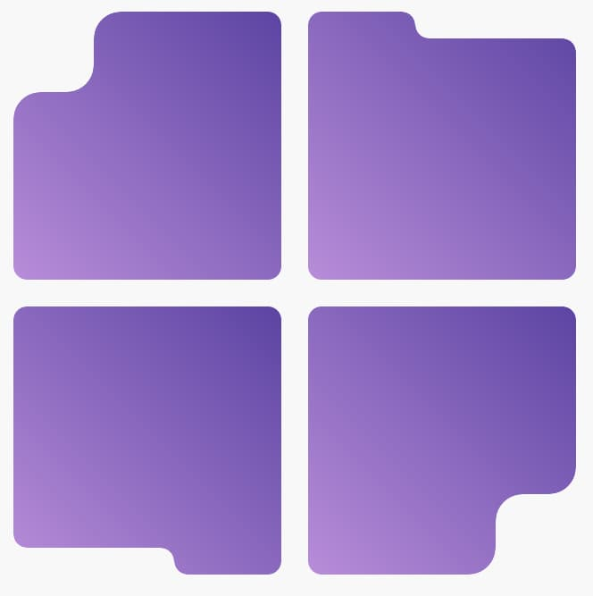

# nebo.css

Negative border radius made easy

> Nebo.css — это чистое CSS-решение, которое позволяет добавлять на элементы «выпуклый» или «вогнутый» пазловый угол без
> SVG и JavaScript. Все управляется через кастомные CSS-переменные.

## Преимущества

- ⚡ Только CSS — никаких изображений или скриптов;
- 🎛 Гибкая настройка через переменные:
  - `--nb-r` — радиус основного скругления;
  - `--nb-w` — ширина выступа/выреза;
  - `--nb-h` — высота выступа/выреза;
  - `--nb-cor1-rw`, `--nb-cor1-rh` — радиусы первого угла (ширина/высота);
  - `--nb-cor2-rw`, `--nb-cor2-rh` — радиусы второго угла (ширина/высота);
  - `--nb-curve-rw`, `--nb-curve-rh` — радиусы кривой части (ширина/высота);
- 🧩 4 модификатора для позиционирования угла: `.nebo--tl`, `.nebo--tr`, `.nebo--bl`, `.nebo--br`;
  
- 🖼 Поддерживает любые фоны (сплошные цвета, градиенты, изображения);
- 🔧 SCSS миксин для продвинутой настройки: `@include apply-nebo-corner()`.

## Пример использования

```html

<div class="card nebo nebo--br">
  Контент карточки
</div>
```

```css
.card {
  --nb-r: 24px; /* радиус скругления */
  --nb-w: 28px; /* ширина выступа */
  --nb-h: 28px; /* высота выступа */
  background: linear-gradient(135deg, #b98bff, #6244d6);
  padding: 2rem;
  color: #fff;
  font: 16px/1.4 "Inter", sans-serif;
}
```

Комбинируем модификаторы, чтобы получить четырёхкомпонентный пазл:

```html

<div class="grid">
  <div class="nebo nebo--tl"></div>
  <div class="nebo nebo--tr"></div>
  <div class="nebo nebo--bl"></div>
  <div class="nebo nebo--br"></div>
</div>
```

## Использование в SCSS

Для более точного контроля используйте SCSS миксин:

```scss
.custom-puzzle {
  @include apply-nebo-corner(
    $radius: 24px,        // Установить все радиусы в 24px
    $width: 32px,         // Установить ширину выступа
    $height: 28px,        // Установить высоту выступа
    $corner: "br"         // Позиция в правом нижнем углу
  );
}

.asymmetric-puzzle {
  @include apply-nebo-corner(
    $cor1-rw: 20px,       // Радиус ширины первого угла
    $cor1-rh: 16px,       // Радиус высоты первого угла
    $cor2-rw: 24px,       // Радиус ширины второго угла
    $cor2-rh: 20px,       // Радиус высоты второго угла
    $curve-rw: 18px,      // Радиус ширины кривой
    $curve-rh: 14px,      // Радиус высоты кривой
    $width: 30px,
    $height: 25px,
    $corner: "tl"
  );
}
```

## Браузерная поддержка

| Браузер | Версия | 
|---------|--------|
| Chrome  | 60+    |
| Edge    | 79+    |
| Firefox | 53+    |
| Safari  | 14+    |
